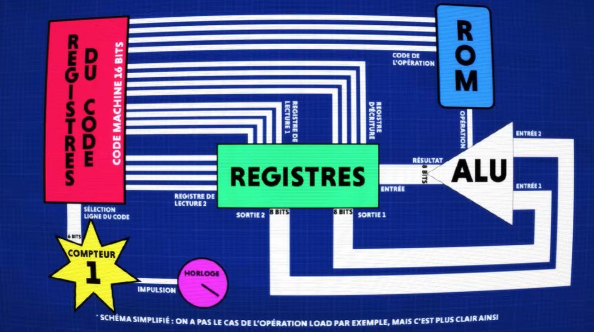
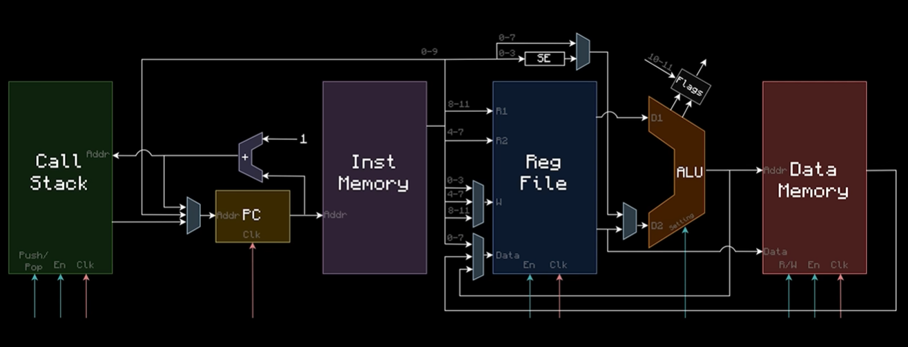

# Let's rebuild CPU from scratch

Ce projet a pour objectif d'explorer les fondements de l'informatique en reconstruisant un processeur complet à partir de portes logiques élémentaires.

## Objectifs du projet

- Comprendre en profondeur le fonctionnement interne d'un CPU.
- Maîtriser l'agencement des composants (ALU, Registres, Unité de contrôle, PC).
- Apprendre à concevoir des circuits logiques modulaires et réutilisables.

## Logiciel utilisé

L'intégralité du projet est conçue avec Logisim-Evolution. C'est un outil puissant et pédagogique qui permet de simuler des circuits numériques complexes et de créer des sous-circuits personnalisés pour une conception hiérarchique.

**téléchargement** :

- https://github.com/logisim-evolution/logisim-evolution

## Modele utiliser

Ce projet s'appuie sur des tutoriels issus de Minecraft. Cette approche permet de visualiser concrètement la structure détaillée des composants avant de les reconstruire dans Logisim-Evolution

## Les differentes architectures

### CPU_V1

L'achitecture de ce processeur est basé sur la video de **V2F** :

- https://www.youtube.com/watch?v=8iLduIDZVE4&t=4s

### CPU_V2

L'achitecture de ce processeur est basé sur las videos de **mattbatwings** :

- https://www.youtube.com/playlist?list=PL5LiOvrbVo8nPTtdXAdSmDWzu85zzdgRT
